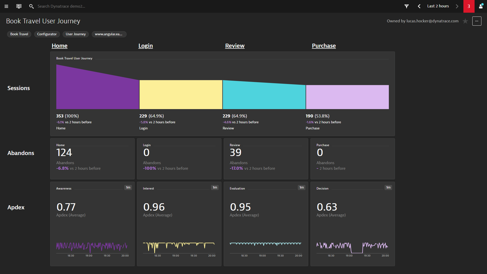

## BizOps User Journey Dashboard
This dashboard pack provides a quick overview of your user journey with a focus on conversion count, abandon count, durtion average and error count for each user journey step. Mark each step of your user journey as a key user action or conversion goal. Each step header is a drill down link to a dashboard the compares sessions that continued vs sessions that exited for each user journey step.

[Prerequisites Video Coming Soon]()

[Deployment Video Coming Soon]()

[Usage Video Coming Soon]()

# Prerequisites Highlights

1. Mark each user action step as a key user action for the user journey
2. Create a session property for revenue (i.e. revenue - CSS selector)
